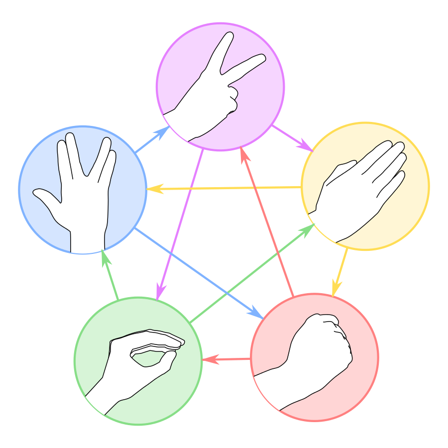
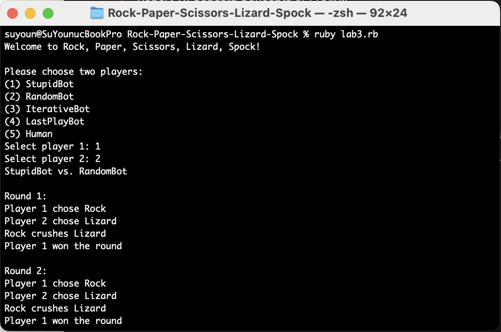

# Rock-Paper-Scissors-Lizard-Spock

Rock-paper-scissors-lizard-Spock is a five-gesture expansion of the classic game rock-paper-scissors. The game was invented by Sam Kass, but popularized in this clip from the TV show Big Bang Theory.

This diagram explains the outcomes of the game:



"Rock Paper Scissors Lizard Spock" is licensed under CC BY-SA 3.0

## Table of Contents
- [Introduction](#introduction)
- [Installation](#installation)
- [Usage](#usage)
- [Testing](#testing)
- [License](#license)

## Introduction

This project is an implementation of the Rock-Paper-Scissors-Lizard-Spock game in Ruby. It aims to provide a fun and educational way to understand basic programming concepts and practice writing clean, maintainable code.

## Installation

To use this project, you need to have Ruby installed. If you haven't installed Ruby yet, you can download it from [here](https://www.ruby-lang.org/en/downloads/).

Once you have Ruby installed, you can follow these steps:

1. Clone this repository to your local machine:
   ```bash
   git clone https://github.com/your-username/your-project.git
    ```
2. Navigate to the project directory:
    ```bash
    cd your-project
    ```

## Usage

After installing the project, you can use it as follows:
```bash
ruby lab3.rb
```
Upon running the script, you will be greeted with a welcome message and prompted to select Player 1 and Player 2 from a list. You can only make valid selections from the list of six available players, or start over and select Player1 and Player 2 again.
The program will then play five rounds of Rock-Paper-Scissors-Lizard-Spock. For each round, it will display the moves selected by each player and print out the result description (e.g., "Rock crushes Scissors"). Finally, it will determine the winner of the game.

### Example Output


## Testing
In the directory tests you will find a number of pairs of files representing the given input and expected output of the test.
```bash
ruby lab3.rb < ./tests/t11.in
```
The above line will execute lab3.rb piping in the commands given in file `t11.in`. You can compare your result with the expected output given in file `t11.out`.
The test naming scheme corresponds to the players of the game. For example, test `t43.in` chooses LastPlayBot (option 4) as Player 1 and Iterative Bot (option 3) as Player 2.

## License
This project is licensed under the MIT License. See the LICENSE file for details.